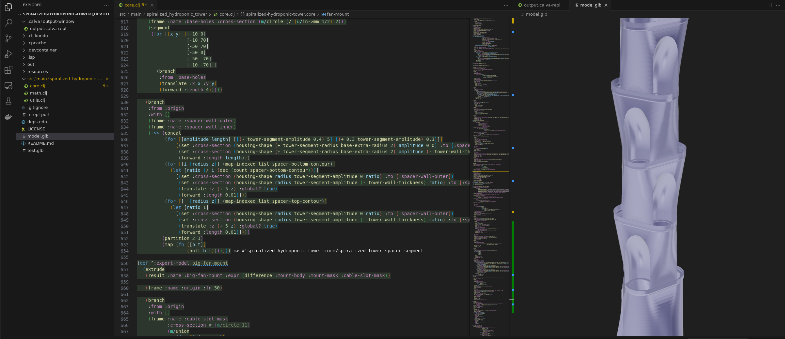
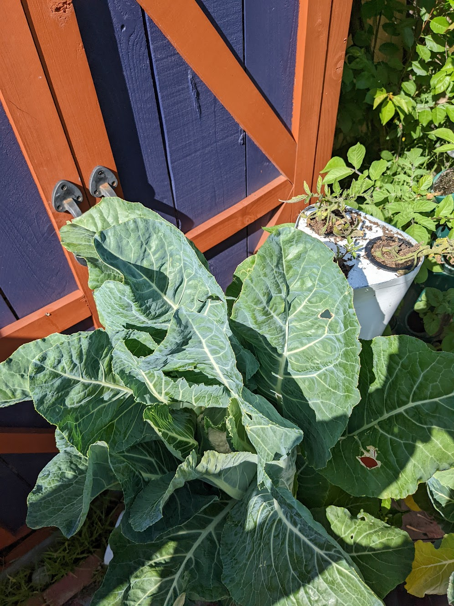
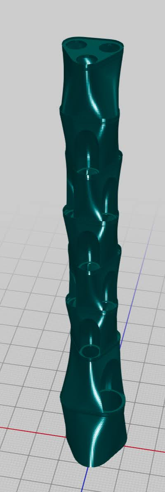
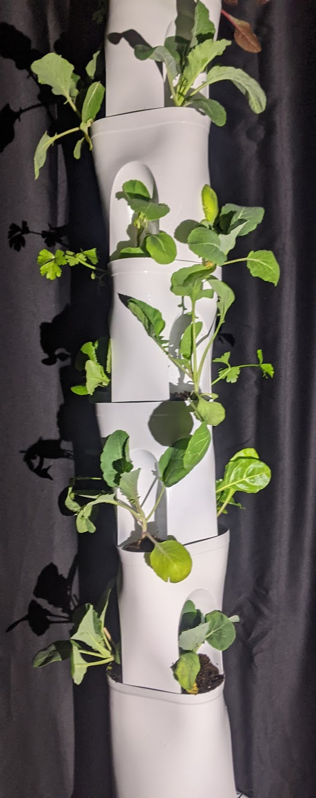

# Spiralized Tower

This is code for a rapidly printable hydroponic tower. It's designed almost entirely printed with "spiralized outer contours" and a 0.8mm nozzle. Simply set the bottom width to 5.0mm and print away. The bottom reservoir is 1.6mm thickness and should not be printed spiralized. There is an optional ultrasonic fogger reservoir that attaches to the top that will shower your plants with ultrasonic fog, helping to maintain a high internal humidity level. The segments are compression fit together, which helps keep the fog contained.

NOTE: Cura changed (broke) the spiralized contours implementation in 5.x. Use 4.x to spiralize properly. On the flip side, the non-spiralized handling of single-wall prints is grealy improved in 5.x, so you'll generally get good quality without spiralized contours as well.


The yields are great!

# Development

You can launch the project as a VSCode dev container to start developing right away. Once inside the container, you can view your models by selecting "Open With..." and "gLTF Model Viewer". Note, the popular gLTF Tools plugin does not work with Calva plugin at the moment. You will likely want to create a key binding to make it easy to export the current form as a .glb model. in `keybindings.json`:

``` json
{
    "key": "ctrl+alt+m",
    "command": "cal va.runCustomREPLCommand",
    "args": {
        "snippet": "(require '[plexus.core :refer [export]])(plexus.core/export (if (var? $current-form) (deref $current-form) $current-form) \"model.glb\" (m/material :color [0.7 0.7 1.0 1.0]))",
    }
}
```


<p float="left">
  
   
</p>

